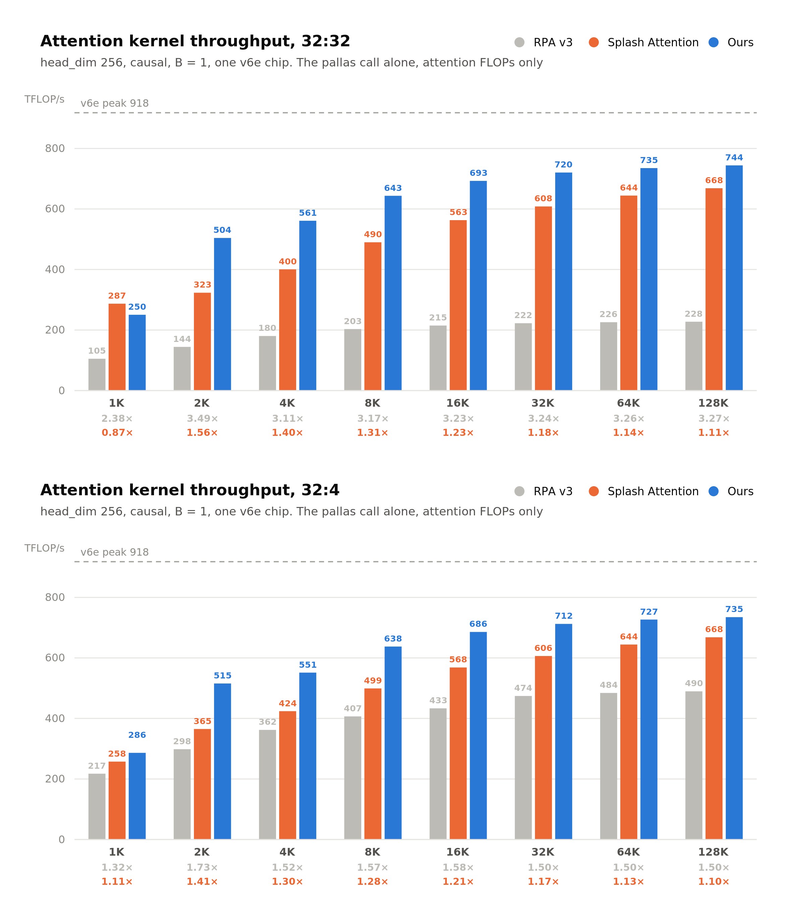
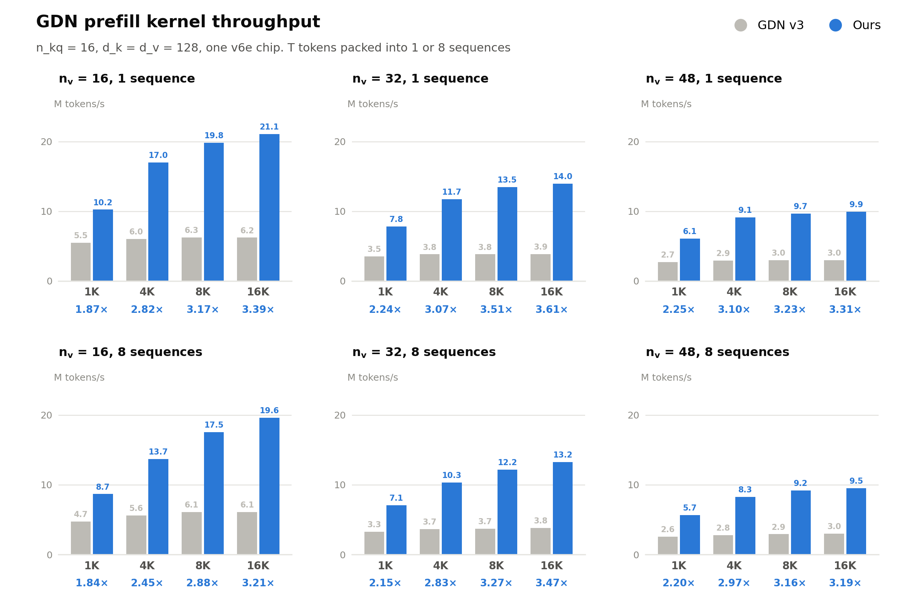

<p align="center">
  <picture>
    <source media="(prefers-color-scheme: dark)" srcset="assert/logo-lockup-dark.svg">
    
  </picture>
</p>

## News

- [2026/09] FlyWheel 0.1.0 is released: flash-attn-style softmax attention
  (forward and backward, varlen, KV cache) and fused GDN/KDA linear attention
  kernels for TPU.

## About

FlyWheel is an attention kernel library for TPU developed by
[heavyball-research](https://github.com/heavyball-research), implemented in
JAX Pallas. It provides high-performance implementations of MHA, MQA/GQA and
linear attention.

## Install

```bash
pip install flywheel-tpu            # CPU, Pallas interpret mode
pip install "flywheel-tpu[tpu]"     # TPU VM, adds jax[tpu]>=0.11.0
```

From source, with [uv](https://github.com/astral-sh/uv) (needed for the
benchmarks and end-to-end evaluation below):

```bash
git clone https://github.com/heavyball-research/flywheel-tpu.git && cd flywheel-tpu
uv sync --extra tpu     # plain `uv sync` off TPU
source .venv/bin/activate
```

The benchmarks below run in this venv. The numbers in this README were measured
with `jax[tpu]==0.11.0` and `libtpu==0.0.44`, the stack tpu-inference runs.

## How to use flywheel

The main functions implement scaled dot product attention
(softmax(Q @ K^T * softmax_scale) @ V), with the same names and arguments as
[flash-attn](https://github.com/Dao-AILab/flash-attention), taking and
returning JAX arrays:

```python
from flywheel_tpu import flash_attn_func, flash_attn_varlen_func, flash_attn_with_kvcache
```

All inputs must be bfloat16. `dropout_p`, `alibi_slopes`, `deterministic`,
`return_attn_probs` and `attention_chunk` are accepted for compatibility and
raise `NotImplementedError` on any non-default value. `interpret=True` runs
the Pallas TPU interpreter, e.g. on CPU.

```python
flash_attn_func(q, k, v, dropout_p=0.0, softmax_scale=None, causal=False,
                window_size=(-1, -1), attention_chunk=None, softcap=0.0,
                alibi_slopes=None, deterministic=False, return_attn_probs=False,
                return_softmax_lse=False, interpret=False, head_dim=None,
                token_major=False, *, rotary_cos=None, rotary_sin=None,
                rotary_interleaved=True, rotary_k=True, heads_outer_fold=False):
"""Unlike flash-attn, the default layout is head-major, (batch, nheads, seqlen, headdim),
which is the kernel's own layout, so no operand is relaid out.
Supports multi-query and grouped-query attention (MQA/GQA) by passing in KV with fewer heads
than Q. Note that the number of heads in Q must be divisible by the number of heads in KV.
If causal=True, the causal mask is aligned to the bottom right corner of the attention matrix.
If the row of the mask is all zero, the output will be zero (and lse -inf).
If window_size != (-1, -1), implements sliding window local attention. Query at position i
will only attend to keys between
[i + seqlen_k - seqlen_q - window_size[0], i + seqlen_k - seqlen_q + window_size[1]] inclusive.
seqlen_q may be any length. seqlen_k must be a multiple of 128 unless causal=True or
window_size[1] == 0.
jax.grad runs the Pallas backward kernel for MHA and MQA/GQA with causal or full masks.
window_size, softcap, rotary and heads_outer_fold are forward-only: their gradient raises
NotImplementedError.

Arguments:
    q: (batch_size, nheads, seqlen_q, headdim)
    k: (batch_size, nheads_k, seqlen_k, headdim)
    v: (batch_size, nheads_k, seqlen_k, headdim_v). headdim_v may differ from headdim.
        With token_major=True, q/k/v are (batch_size, seqlen, nheads * headdim).
    softmax_scale: float. The scaling of QK^T before applying softmax.
        Default to 1 / sqrt(headdim).
    causal: bool. Whether to apply causal attention mask (e.g., for auto-regressive modeling).
    window_size: (left, right). If not (-1, -1), implements sliding window local attention.
    softcap: float. Anything > 0 activates softcapping attention:
        tanh(softmax_scale * q @ k^T / softcap) * softcap.
    return_softmax_lse: bool. Whether to also return the logsumexp of the scaled, masked
        attention scores.
    head_dim: int. Required with token_major=True, where the fused last axis alone does not
        give the head split: a multiple of 128, or 64 for MHA with an even nheads.
    token_major: bool. See above.
    rotary_cos [optional]: (seqlen_ro, headdim / 2), in q's dtype or float32. The cos of the
        rotary embedding applied to q and k inside the kernel. headdim must be divisible by 16.
        k is rotated at positions 0 .. seqlen_k - 1 and q from seqlen_k - seqlen_q on, so
        seqlen_q <= seqlen_k.
    rotary_sin [optional]: (seqlen_ro, headdim / 2). Similar to rotary_cos.
    rotary_interleaved: bool. Only applicable if rotary_cos and rotary_sin are passed in.
        If True, rotary embedding will combine dimensions 0 & 1, 2 & 3, etc. If False,
        rotary embedding will combine dimensions 0 & headdim / 2, 1 & headdim / 2 + 1
        (i.e. GPT-NeoX style).
    rotary_k: bool. If False, only q is rotated.
    heads_outer_fold: bool. q/k/v and out are (nheads, batch_size, seqlen, headdim) instead.
        Forward-only, with no return_softmax_lse and only q-only rotary (rotary_k=False).
Return:
    out: (batch_size, nheads, seqlen_q, headdim_v), or (batch_size, seqlen_q,
        nheads * headdim_v) with token_major=True.
    softmax_lse [optional, if return_softmax_lse=True]: (batch_size, nheads, seqlen_q), float32.
        The natural-log logsumexp of each row of the scaled, masked attention scores.
"""
```

```python
flash_attn_varlen_func(q, k, v, cu_seqlens_q, cu_seqlens_k, max_seqlen_q, max_seqlen_k,
                       dropout_p=0.0, softmax_scale=None, causal=False, window_size=(-1, -1),
                       softcap=0.0, alibi_slopes=None, deterministic=False,
                       return_attn_probs=False, return_softmax_lse=False, interpret=False,
                       head_dim=None, token_major=False, block_sizes=None, *,
                       rotary_cos=None, rotary_sin=None, rotary_interleaved=True,
                       rotary_k=True):
"""Attention over sequences packed along the token axis. Unlike flash-attn, the default layout
is head-major, (nheads, total, headdim), which is the kernel's own layout, so no operand is
relaid out.
causal and window_size are bottom-right aligned per sequence, as in flash_attn_func. A row
with no visible key is unspecified, so causal needs seqlen_k >= seqlen_q for every sequence.
Rotary uses per-sequence positions. Forward-only: jax.grad raises NotImplementedError.

Arguments:
    q: (nheads, total_q, headdim), where total_q = total number of query tokens in the batch.
    k: (nheads_k, total_k, headdim), where total_k = total number of key tokens in the batch.
    v: (nheads_k, total_k, headdim_v).
        With token_major=True, q/k/v are (total, nheads * headdim).
    cu_seqlens_q: (batch_size + 1,), int. The cumulative sequence lengths of the sequences
        in the batch, used to index into q. May be traced. Rows past cu_seqlens_q[-1] are
        padding that never attends or is attended.
    cu_seqlens_k: (batch_size + 1,), int. The cumulative sequence lengths of the sequences
        in the batch, used to index into k and v.
    max_seqlen_q: int. Maximum query sequence length in the batch. Must be static: it only
        caps the kernel's block sizes and is bucketed to a power of two, so an underestimate
        is slow, not wrong.
    max_seqlen_k: int. Maximum key sequence length in the batch. Must be static, as above.
        The rotary tables must cover it.
    block_sizes [optional]: (block_q, block_kv, block_q_compute, block_kv_compute). Pins the
        forward tiles instead of the tuned or analytic ones; block_q and block_kv must be
        multiples of 128.
    The other arguments are as in flash_attn_func.
Return:
    out: (nheads, total_q, headdim_v), or (total_q, nheads * headdim_v) with token_major=True.
    softmax_lse [optional, if return_softmax_lse=True]: (nheads, total_q), float32.
"""
```

```python
flash_attn_with_kvcache(q, k_cache, v_cache, k=None, v=None, *, cache_seqlens,
                        cache_batch_idx=None, block_table=None, num_active=None,
                        cu_seqlens_q=None, softmax_scale=None, causal=False,
                        window_size=(-1, -1), return_softmax_lse=False, interpret=False):
"""
If k and v are not None, they are appended to the cache after each row's cache_seqlens
entries, and attention runs against the updated cache, all in 1 kernel. This is useful for
incremental decoding: pass in the cache from the previous step and the new keys/values of
the current step.

JAX arrays are immutable, so unlike flash-attn the updated cache is returned. The function
is jitted with k_cache and v_cache donated, so the update happens in place in HBM; rebind
the returned caches and do not reuse the old ones. Under an outer jax.jit, donate the caches
on that jit instead.

If you pass in k / v, you must make sure that the cache is large enough to hold the new
values. For example, the KV cache could be pre-allocated with the max sequence length, and
you can use cache_seqlens to keep track of the current sequence lengths of each sequence in
the batch.

Unlike flash_attn_func, q is token-major, as in flash-attn. Decode is q with seqlen_q = 1;
seqlen_q > 1 or a packed q with cu_seqlens_q runs chunked prefill against the cache.

Supports MQA/GQA as flash_attn_func does. nheads_k must be even or 1, because the cache load
packs two bf16 heads into one u32 lane. Paged single-token decode also needs nheads_k of
1, 2, 4 or a multiple of 8 (1 or a multiple of 8 at headdim 64).

If causal=True, the causal mask is aligned to the bottom right corner of each request's
attention matrix, as in flash_attn_func. A row with nothing to attend returns out = 0 and
lse = -inf.

If window_size != (-1, -1), implements sliding window local attention, for single-token
decode only.

Arguments:
    q: (batch_size, seqlen_q, nheads, headdim), or (total_q, nheads, headdim) with
        cu_seqlens_q.
    k_cache: (batch_size_cache, seqlen_cache, nheads_k, headdim) if there's no block_table,
        seqlen_cache a multiple of 128,
        or (num_blocks, page_block_size, 2 * nheads_k, headdim) if there's a block_table
        (i.e. paged KV cache). The paged cache merges K and V: each token row holds its
        nheads_k K heads, then its nheads_k V heads. page_block_size must be a multiple of 128.
    v_cache: (batch_size_cache, seqlen_cache, nheads_k, headdim) if there's no block_table,
        or None if there's a block_table.
    k [optional]: (batch_size, seqlen_new, nheads_k, headdim), or (total_q, nheads_k, headdim)
        with cu_seqlens_q. If not None, we concatenate k with k_cache, starting at the
        indices specified by cache_seqlens. Pass k and v together.
    v [optional]: Similar to k.
    cache_seqlens: int, or (batch_size,), int. The sequence lengths of the KV cache before
        the append.
    cache_batch_idx [optional]: (batch_size,), int. The indices used to index into the KV
        cache. If None, we assume that the batch indices are [0, 1, 2, ..., batch_size - 1].
        Contiguous cache only.
    block_table [optional]: (batch_size, max_num_blocks_per_seq), int. Maps each row's
        positions to cache pages. Pages an append writes must be private to the request.
    num_active [optional]: int. The leading rows that are real requests; later rows are
        skipped, and their out / lse are 0 / -inf on multi-token and packed calls but
        unspecified on single-token decode.
    cu_seqlens_q [optional]: (batch_size + 1,), int. Nondecreasing query boundaries from 0 to
        at most total_q; buffer padding past cu_seqlens_q[-1] returns out = 0 and lse = -inf.
    softmax_scale, causal, window_size: as in flash_attn_func.
    cache_seqlens, cache_batch_idx, block_table, num_active and cu_seqlens_q may be traced.

Return:
    out: (batch_size, seqlen_q, nheads, headdim), or (total_q, nheads, headdim) with
        cu_seqlens_q.
    softmax_lse [optional, if return_softmax_lse=True]: (batch_size, nheads, seqlen_q), or
        (nheads, total_q) with cu_seqlens_q, float32.
    k_cache, v_cache: the updated caches, or the updated merged kv_cache alone if there's a
        block_table. The full return is (out, [softmax_lse,] k_cache, v_cache) or
        (out, [softmax_lse,] kv_cache).
"""
```

To see the implementation of these functions, check
[flash_attn_interface.py](flywheel_tpu/flash_attn_interface.py).

The linear-attention layers of hybrid models, Gated DeltaNet (GDN, e.g.
Qwen3-Next) and Kimi Delta Attention (KDA, e.g. Kimi Linear), each run as one
fused kernel: causal depthwise conv1d + silu over the packed qkv projection,
then the chunked delta rule, over a ragged serving batch whose per-request
conv and recurrent states live in slot caches:

```python
from flywheel_tpu.linear_attention import fused_conv1d_gdn, fused_conv1d_kda
```

Both are inference-only (no backward pass), take bfloat16 activations, and are
jitted with `conv_state` and `recurrent_state` donated: rebind the returned
caches and do not reuse the old ones.

```python
fused_conv1d_gdn(qkv, b, a, conv_state, recurrent_state, conv_weight, conv_bias,
                 a_log, dt_bias, query_start_loc, state_indices, distribution,
                 seq_lens, read_state_indices, read_offsets=None, *, n_kq, n_v,
                 d_k, d_v, kernel_size, num_spec_tokens=0, zero_initialize_out=True,
                 compute_precision=jnp.float32, decode_tile_size=4,
                 mixed_tile_size=128, compute_chunk_size=64):
"""Per token t of a sequence, after the conv1d + silu, with one (d_k, d_v) state S per
value head:
    q_t = l2norm(q_t) / sqrt(d_k),  k_t = l2norm(k_t)
    beta_t = sigmoid(b_t),  g_t = -exp(a_log) * softplus(a_t + dt_bias)
    S_t = exp(g_t) * S_{t-1} + beta_t * k_t (v_t - exp(g_t) * S_{t-1}^T k_t)^T
    o_t = S_t^T q_t
Supports grouped value heads: n_v must be divisible by n_kq, and value head h reads
q/k head h // (n_v / n_kq).
Sequences are packed along the token axis as in flash_attn_varlen_func, decodes first. A
sequence with no prior context (seq_lens equal to its new token count) starts from a zero
state, so its slots may hold garbage.

Arguments:
    qkv: (num_tokens, dim), bfloat16, dim = 2 * n_kq * d_k + n_v * d_v. q, k and v
        concatenated along the last axis in that order, each (nheads * headdim).
    b: (num_tokens, n_v). The input to beta.
    a: (num_tokens, n_v). The input to the decay gate.
    conv_state: (num_slots, kernel_size - 1, dim). The last kernel_size - 1 conv inputs
        of each slot. Slot 0 is the null block for padded or invalid tokens.
    recurrent_state: (num_slots, n_v, d_k, d_v). The state S of each slot, same null block.
    conv_weight: (dim, 1, kernel_size). The depthwise conv weight.
    conv_bias [optional]: (dim,).
    a_log: (n_v,). The per-head log decay scale.
    dt_bias: (n_v,). The bias of the decay gate.
    query_start_loc: (num_seqs + 1,), int. The cumulative token counts of the sequences,
        used to index into qkv, like cu_seqlens_q.
    state_indices: (num_seqs,), int. The slot each sequence writes its final state to.
        With num_spec_tokens > 0, the base of each request's num_spec_tokens + 1
        consecutive slots.
    distribution: (3,), int32. [decode_end, prefill_end, mixed_end]. Sequences
        [0, decode_end) are single-token decodes, or verify windows of up to
        num_spec_tokens + 1 tokens; [decode_end, mixed_end) are prefills or chunked
        prefills; sequences from mixed_end on are skipped.
    seq_lens: (num_seqs,), int. The length of each sequence including its new tokens.
    read_state_indices: (num_seqs,), int. The slot each sequence reads its initial state
        from. Equals state_indices unless prefix caching resumes from a cached state block.
    read_offsets [optional]: (num_seqs,), int32. Required if num_spec_tokens > 0: the
        number of accepted tokens minus 1 from the last verify step. A windowed sequence
        reads its state from read_state_indices[s] + read_offsets[s] and writes the state
        after window position t to state_indices[s] + t.
    n_kq, n_v: int. The number of q/k heads and of value heads.
    d_k, d_v: int. The q/k and value head dims.
    kernel_size: int. The conv kernel size, between 2 and 17.
    num_spec_tokens: int. The speculative draft tokens per request; 0 gives plain
        one-token decode.
    zero_initialize_out: bool. Whether to zero the output rows past the last real token,
        which no sequence owns.
    compute_precision: dtype. The dtype of the in-kernel math.
    decode_tile_size: int. Sequences per decode tile.
    mixed_tile_size: int. Tokens per prefill tile, a multiple of compute_chunk_size.
    compute_chunk_size: int. Tokens per chunked delta-rule step: a multiple of 16 larger
        than kernel_size - 1; above 64 a multiple of 64, above 256 of 256, and so on.
Return:
    (conv_state, recurrent_state): The updated caches, in their input dtypes.
    out: (num_tokens, n_v * d_v), bfloat16.
    The full return is ((conv_state, recurrent_state), out).
"""
```

```python
fused_conv1d_kda(qkv, b, g, conv_state, recurrent_state, conv_weight, conv_bias,
                 a_log, dt_bias, query_start_loc, state_indices, distribution,
                 seq_lens, read_state_indices, read_offsets=None, *, n_kq, n_v,
                 d_k, d_v, kernel_size, num_spec_tokens=0, zero_initialize_out=True,
                 compute_precision=jnp.float32, decode_tile_size=4,
                 mixed_tile_size=128, compute_chunk_size=64, lower_bound=None,
                 beta_is_activated=False):
"""The gated delta rule of fused_conv1d_gdn with one decay gate per key channel: the log
decay d_t is (n_v, d_k) per token, computed from the raw gate g_t, and decays the state
row-wise:
    d_t = -exp(a_log) * softplus(g_t + dt_bias), or, with lower_bound,
          lower_bound * sigmoid(exp(a_log) * (g_t + dt_bias))
    S_t = diag(exp(d_t)) S_{t-1} + beta_t * k_t (v_t - (diag(exp(d_t)) S_{t-1})^T k_t)^T

Arguments:
    g: (num_tokens, n_v * d_k), bfloat16. The raw gate, head-major like q and k. It
        replaces fused_conv1d_gdn's a.
    a_log: (n_v,). The per-head log decay scale.
    dt_bias: (n_v * d_k,). The per-channel bias of the decay gate.
    lower_bound [optional]: float. A finite negative bound on the log decay, switching the
        gate to the sigmoid form above.
    beta_is_activated: bool. Whether b already holds beta, skipping its sigmoid.
    The other arguments and the return are as in fused_conv1d_gdn.
"""
```

Their implementations are in
[gdn/wrapper.py](flywheel_tpu/linear_attention/gdn/wrapper.py) and
[kda/wrapper.py](flywheel_tpu/linear_attention/kda/wrapper.py), with tests in
[tests/linear_attention/](tests/linear_attention/).

## Benchmarks

### Softmax attention

Causal prefill on one v6e chip, head_dim 256, B = 1, for 32:32 (MHA)
and 32:4 (GQA) heads. The rows under each sequence length are our speedup
over [RPA v3](https://github.com/vllm-project/tpu-inference/tree/4420cae/tpu_inference/kernels/ragged_paged_attention/v3) (gray) and [Splash Attention](https://github.com/openxla/tokamax/tree/84e5f36/tokamax/_src/ops/experimental/tpu/splash_attention) (orange).



Every number in the figure comes from
[`benchmarks/softmax_attention/`](benchmarks/softmax_attention/). Each cell
times a whole attention block under one `jax.jit`, from hidden states
x (B, T, d_model) to hidden states out, with d_model = heads × head_dim:

1. qkv projection: one einsum per q, k and v, each emitting the layout its
   kernel takes, as vLLM's attention layer does;
2. layout: whatever relayout XLA could not fold into the projection;
3. the attention kernel;
4. output projection.

| Backend | Kernel input | Kernel |
|---|---|---|
| flywheel | (B, heads, T, head_dim) | `flash_attn_func` |
| Splash Attention | (B · heads, T, head_dim) | `make_splash_mha_single_device` |
| RPA v3 | (B · T, heads, head_dim) and a paged KV cache | `ragged_paged_attention`, which also writes the cache |

Each cell yields two numbers:

- **Block level**: the median wall clock of the jitted block, from
  back-to-back calls with one sync per round
  ([`common/timing.py`](benchmarks/common/timing.py)).
- **Kernel level**, which the figure plots: the cell reruns 3 calls under
  `jax.profiler`, and `segments.py` reads the device events of that same
  executable from the trace. Every leaf op goes into one segment by what it
  is: the Pallas call into `attn_kernel`, pure data movement (copy,
  transpose, reshape, slice, pad, dtype conversion, ...) into `layout`, and
  the rest into `qkv_proj` or `out_proj` by its `jax.named_scope`. Anything
  left is reported as `other`. The figure's throughput is attention FLOPs /
  `attn_kernel` time, with attention FLOPs = 4 · B · T² · heads · head_dim,
  halved for causal; the speedup rows are ratios of these throughputs.

Both baselines are loaded from their pinned submodules, with no install, and
each loaded file is checked against its SHA-256 at the pin:
tpu-inference's [RPA v3](https://github.com/vllm-project/tpu-inference/tree/4420cae/tpu_inference/kernels/ragged_paged_attention/v3)
at `4420cae` and Tokamax's [Splash Attention](https://github.com/openxla/tokamax/tree/84e5f36/tokamax/_src/ops/experimental/tpu/splash_attention)
at `84e5f36`. Their block configs come from `rpa_tuned_v6e.json` and
`splash_tuned_v6e.json` next to the script, searched earlier per
(heads, heads_k, head_dim, mask, T) at B = 1 on v6e; the tuners are not in
this repo. The tables cover every cell of the figure. A cell outside them
runs RPA's `get_default_block_sizes` or Tokamax's heuristic config instead,
and its JSONL record says so in `block_source` / `config_source`. flywheel
runs its own block-size lookup inside `flywheel_tpu`.

To reproduce the figure, sequentially on one v6e chip:

```bash
git submodule update --init third_party/tpu-inference third_party/tokamax
benchmarks/softmax_attention/attention_block.sh results/benchmark/softmax_attention
```

The defaults are the figure's grid: RPA v3, Splash Attention and flywheel,
32 q heads with 32 or 4 kv heads, head_dim 256, causal, B = 1, T from 1K to
128K. `IMPLS`, `HEADS`, `HEADS_K`, `HEAD_DIM`, `MASK` and `SEQLENS` override
them. The output directory gets `benchmark.jsonl`, `benchmark.log` and one
profiler trace per cell under `traces/`, which XProf opens. At the end the
script prints the kernel-level table the figure plots and the block-level
split, which shows the layout work RPA v3 does before its kernel runs and
flywheel and Splash Attention do not need. Rerunning into the same directory
measures every cell again, and the last ok record of each cell wins.

To time one cell, reprint the tables, or re-split a directory of traces:

```bash
PYTHONPATH=. uv run --no-sync python benchmarks/softmax_attention/attention_block.py \
    --impl flywheel --heads 32 --heads-k 4 --head-dim 256 --seq 8192 \
    --output results/benchmark/softmax_attention/benchmark.jsonl \
    --trace results/benchmark/softmax_attention/traces
PYTHONPATH=. uv run --no-sync python benchmarks/softmax_attention/report.py \
    results/benchmark/softmax_attention/benchmark.jsonl
PYTHONPATH=. uv run --no-sync python benchmarks/softmax_attention/segments.py \
    results/benchmark/softmax_attention/traces
```

Only fixed-shape prefill is benchmarked; the varlen and KV-cache APIs have
no benchmark entrypoint.

### Linear attention

GDN prefill on one v6e chip, n_kq = 16 and d_k = d_v = 128, with T tokens
packed into 1 or 8 sequences. The row under each sequence length is our
speedup over the vendored `gdn_v3` baseline (gray).



For GDN and KDA kernels, the vendored baselines live in
`benchmarks/linear_attention/baseline_kernel/`. The GDN benchmark compares
`gdn_v3` with our fused kernel by default; KDA's `--impl baseline` times the
chunked forward baseline, while `--pkgs` times fused kernels:

```bash
PYTHONPATH=. uv run --no-sync python benchmarks/linear_attention/benchmark/bench_gdn_fwd.py \
    --output results/gdn_fwd.json
PYTHONPATH=. uv run --no-sync python benchmarks/linear_attention/benchmark/bench_kda_fwd.py \
    --pkgs flywheel_tpu.linear_attention.kda --output results/kda_fwd.json
PYTHONPATH=. uv run --no-sync python benchmarks/linear_attention/benchmark/bench_kda_fwd.py \
    --impl baseline --output results/kda_fwd_baseline.json
```

## End-to-end evaluation

### vLLM backend (tpu-inference)

The vLLM TPU backend is upstream
[tpu-inference](https://github.com/vllm-project/tpu-inference) pinned as the
`third_party/tpu-inference` submodule, plus `patches/tpu-inference.patch`,
which routes attention and GDN/KDA linear attention to the kernels in this
repo. On a TPU VM, from a checkout of this repo (needs
[just](https://github.com/casey/just) and [uv](https://github.com/astral-sh/uv)):

```bash
# 1. Check out the pinned tpu-inference and apply the patch.
just tpu-inference-apply

# 2. Clone vLLM at the commit the pinned tpu-inference is validated against.
git clone https://github.com/vllm-project/vllm.git ../vllm
git -C ../vllm checkout "$(cat third_party/tpu-inference/.buildkite/vllm_lkg.version)"

# 3. Install vLLM, the patched tpu-inference, and flywheel_tpu into one venv.
sudo apt-get update && sudo apt-get install -y libopenblas-base libopenmpi-dev libomp-dev
uv venv vllm_env --python 3.12 && source vllm_env/bin/activate
(cd ../vllm && uv pip install -r requirements/tpu.txt --torch-backend=cpu \
  && VLLM_TARGET_DEVICE=tpu uv pip install -e . --no-build-isolation)
uv pip install -e third_party/tpu-inference -e .
```

The kernels are off by default and switched on per attention family:

```bash
USE_FLYWHEEL_TPU_KERNEL=1 \
USE_FLYWHEEL_TPU_LINEAR_KERNEL=1 \
vllm serve Qwen/Qwen3-4B
```

`USE_FLYWHEEL_TPU_KERNEL` replaces RPA v3 for softmax attention and
`USE_FLYWHEEL_TPU_LINEAR_KERNEL` replaces the GDN/KDA kernels of hybrid
models. A configuration a kernel cannot serve fails instead of falling back
to the upstream kernel.

To change the backend, edit `third_party/tpu-inference` in place (the patch
stays uncommitted on top of the pin) and run `just tpu-inference-export` to
write the changes back into the patch. `just tpu-inference-bump <rev>` moves
the pin to a newer upstream commit and re-applies the patch with a 3-way
merge, stopping on conflicts.

### Setup

On every host, with the venv of the vLLM backend section activated:

```bash
eval/setup.sh deps                            
eval/setup.sh model                           
eval/setup.sh ruler                           
eval/setup.sh babilong --lengths "128k 256k"  
eval/setup.sh videomme                        
```

The runs themselves are offline. Each sweep runs its points one after
another and skips the ones that already finished, so an interrupted sweep
picks up where it stopped. Results go to `~/eval-logs/<eval>` unless `--out`
names another directory, and `--tp-size` (default 8) sets the tensor
parallelism. These commands and scripts assume a single host that holds every
chip of the run (e.g. a v6e-8 at the default `--tp-size 8`); on a machine of
several hosts, adapt them by hand and start Ray first, as in the multi-host
example below:

```bash
eval/ruler/run_ruler_sweep.sh --seqlens "4096 32768 131072"
eval/babilong/run_babilong_sweep.sh --lengths "128k 256k"
eval/videomme/run_videomme_sweep.sh --frames "1024 2048"
```

To run on multiple hosts:

```bash
eval/setup.sh babilong --lengths 512k    # on the host that runs the eval
ray start --head --port=6379             # on the host that runs the eval
ray start --address=<head ip>:6379       # on every other host
eval/babilong/run_babilong_sweep.sh --lengths 512k --cp-size 2 --enable-sp \
    --yarn-factor 2 --multihost --out ~/eval-logs/babilong
eval/ruler/run_ruler_sweep.sh --seqlens 524288 --cp-size 2 --enable-sp \
    --yarn-factor 2 --multihost --out ~/eval-logs/ruler
```

Start Ray without `USE_FLYWHEEL_TPU_*` or `RPA_V3_*` set: the driver's kernel
switches reach the Ray workers only where a node does not already set them.
