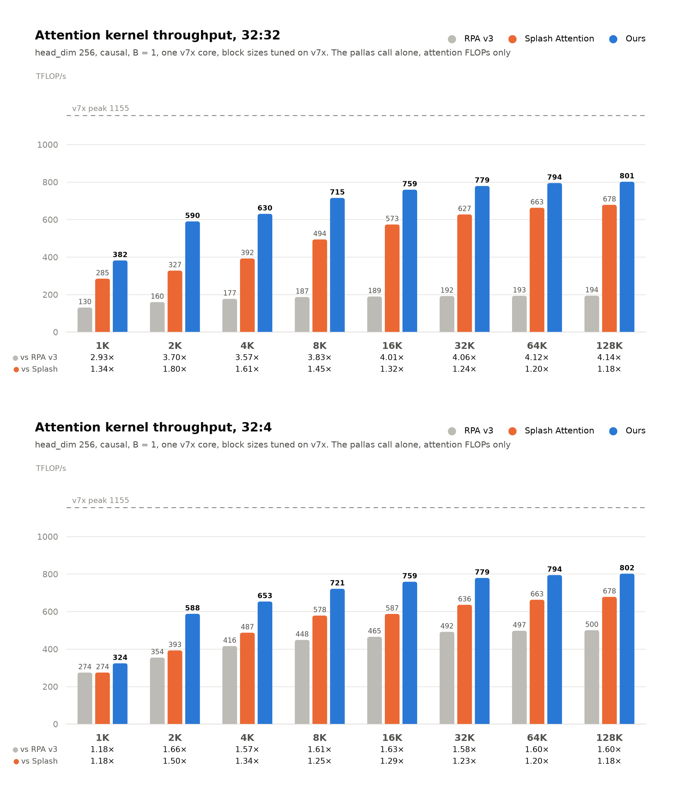
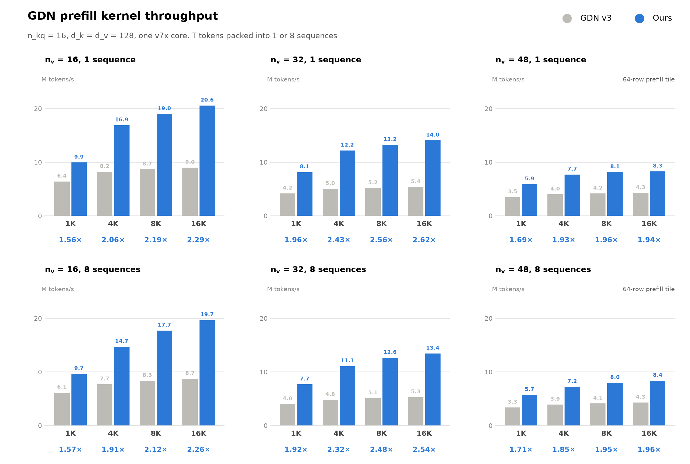

# FlyWheel on TPU v7x

The benchmarks in the [README](README.md) were measured on v6e. This page has
the softmax and linear attention benchmarks on v7x, measured the same way and
on the same stack, `jax[tpu]==0.11.0` and `libtpu==0.0.44`.

## Softmax attention

Causal prefill on one v7x core, head_dim 256, B = 1, for 32:32 (MHA)
and 32:4 (GQA) heads. The rows under each sequence length are our speedup
over [RPA v3](https://github.com/vllm-project/tpu-inference/tree/4420cae/tpu_inference/kernels/ragged_paged_attention/v3) and [Splash Attention](https://github.com/openxla/tokamax/tree/84e5f36/tokamax/_src/ops/experimental/tpu/splash_attention).



Every number comes from
[`benchmarks/softmax_attention/`](benchmarks/softmax_attention/), with the
block, the timing and the trace split described in the
[README](README.md#softmax-attention). Three things differ on v7x:

- **One device is one core.** A v7x chip has two TensorCores and JAX lists
  each as a device, so the `jax.devices()[0]` the benchmark runs on is half a
  chip. The dashed line is that core's bf16 peak,
  `pltpu.get_tpu_info().bf16_ops_per_second`.
- **The block configs are tuned on v7x.** A v7x core has 64 MiB of VMEM, less
  than the configs searched on v6e need: RPA v3's v6e entries run out of VMEM
  on 15 of the 16 cells, and Splash Attention's at 64K and 128K. So
  [`tune_blocks.py`](benchmarks/softmax_attention/tune_blocks.py) searched all
  three kernels per cell on v7x, into `rpa_tuned_v7x.json`,
  `splash_tuned_v7x.json` and the `"TPU v7"` section of
  [`tuned_configs.json`](flywheel_tpu/tuned_configs.json), and
  `attention_block.py` reads the tables of the chip it runs on. At 32:32 RPA
  v3's own v7 default formula runs out of VMEM as well, on every cell; what
  fits is `[128, 256, 128, 256]`, which is its tuned config from 1K to 128K.
  flywheel's analytic defaults were already close: tuning moved its kernel by
  about 2% at the median, and by 22% at 1K for 32:32, where it folds heads.
- **The trace split reads the TensorCore only.** On v7x XLA offloads RPA v3's
  relayout copies to the SparseCores, which adds their processes to the
  trace. `segments.py` leaves them out: the TensorCore's wait for them is
  already on its own timeline, in the `layout` segment.

Kernel level, TFLOP/s, which the figure plots:

| 32:32 | RPA v3 | Splash Attention | flywheel | vs RPA v3 | vs Splash |
|---|---|---|---|---|---|
| 1K | 130 | 285 | 382 | 2.93x | 1.34x |
| 2K | 160 | 327 | 590 | 3.70x | 1.80x |
| 4K | 177 | 392 | 630 | 3.57x | 1.61x |
| 8K | 187 | 494 | 715 | 3.83x | 1.45x |
| 16K | 189 | 573 | 759 | 4.01x | 1.32x |
| 32K | 192 | 627 | 779 | 4.06x | 1.24x |
| 64K | 193 | 663 | 794 | 4.12x | 1.20x |
| 128K | 194 | 678 | 801 | 4.14x | 1.18x |

| 32:4 | RPA v3 | Splash Attention | flywheel | vs RPA v3 | vs Splash |
|---|---|---|---|---|---|
| 1K | 274 | 274 | 324 | 1.18x | 1.18x |
| 2K | 354 | 393 | 588 | 1.66x | 1.50x |
| 4K | 416 | 487 | 653 | 1.57x | 1.34x |
| 8K | 448 | 578 | 721 | 1.61x | 1.25x |
| 16K | 465 | 587 | 759 | 1.63x | 1.29x |
| 32K | 492 | 636 | 779 | 1.58x | 1.23x |
| 64K | 497 | 663 | 794 | 1.60x | 1.20x |
| 128K | 500 | 678 | 802 | 1.60x | 1.18x |

Block level, wall clock of the whole block in ms, from runs with no profiler
in the process:

| 32:32 | RPA v3 | Splash Attention | flywheel | vs RPA v3 | vs Splash |
|---|---|---|---|---|---|
| 1K | 1.023 | 0.689 | 0.682 | 1.50x | 1.01x |
| 2K | 2.122 | 1.476 | 1.379 | 1.54x | 1.07x |
| 4K | 4.792 | 3.467 | 2.940 | 1.63x | 1.18x |
| 8K | 12.336 | 7.202 | 6.515 | 1.89x | 1.11x |
| 16K | 36.065 | 17.568 | 15.674 | 2.30x | 1.12x |
| 32K | 117.371 | 47.857 | 42.351 | 2.77x | 1.13x |
| 64K | 416.074 | 150.139 | 128.196 | 3.25x | 1.17x |
| 128K | 1556.801 | 503.458 | 430.544 | 3.62x | 1.17x |

| 32:4 | RPA v3 | Splash Attention | flywheel | vs RPA v3 | vs Splash |
|---|---|---|---|---|---|
| 1K | 0.581 | 0.423 | 0.420 | 1.38x | 1.01x |
| 2K | 1.076 | 0.895 | 0.832 | 1.29x | 1.08x |
| 4K | 2.375 | 1.983 | 1.843 | 1.29x | 1.08x |
| 8K | 5.668 | 4.715 | 4.329 | 1.31x | 1.09x |
| 16K | 15.457 | 13.038 | 11.322 | 1.37x | 1.15x |
| 32K | 47.732 | 38.788 | 33.612 | 1.42x | 1.15x |
| 64K | 165.722 | 128.563 | 110.790 | 1.50x | 1.16x |
| 128K | 611.513 | 459.806 | 395.692 | 1.55x | 1.16x |

To reproduce the figure, sequentially on a v7x VM:

```bash
git submodule update --init third_party/tpu-inference third_party/tokamax
benchmarks/softmax_attention/attention_block.sh results/benchmark/softmax_attention_v7x
```

### Tuning the block configs

`tune_blocks.py` searches one cell at a time, timing the kernel alone. From
the kernel's own default and its v6e entry it sweeps one config field at a
time, keeps the fastest and repeats until a pass gains under 1%, then times
the fastest few again with the benchmark's protocol. A candidate that aborts
the process, hangs or halts the core is logged before it runs, so running the
same command again resumes past it:

```bash
PYTHONPATH=. uv run --no-sync python benchmarks/softmax_attention/tune_blocks.py \
    --impl rpa --heads 32 --heads-k 4 --head-dim 256 --seq 8192 \
    --output results/tune/softmax_attention
```

Searches of different cells can run side by side, one per chip, with
`TPU_VISIBLE_CHIPS=<chip> TPU_CHIPS_PER_HOST_BOUNDS=1,1,1 TPU_HOST_BOUNDS=1,1,1`
in front of the command. Once every cell has a best config, write the tables:

```bash
PYTHONPATH=. uv run --no-sync python benchmarks/softmax_attention/tune_blocks.py \
    --collect results/tune/softmax_attention
```

`--collect` takes the device from the search logs, not from the machine it
runs on, so it needs no TPU and cannot write one chip's configs into another
chip's tables. It writes each table whole, and refuses when the table already
holds cells the directory has no search for. A chip `attention_block.py` has
no table suffix for needs an entry in its `TABLE_TAGS` first.

## Serving with a KV cache

The tables above time `flash_attn_func`, flywheel's dense prefill. In serving,
flywheel's vLLM backend calls `flash_attn_with_kvcache` for a prefill chunk
that attends to cached tokens and for decode, and RPA v3 serves both from the
same paged cache. These two scenarios compare those kernels on one v7x core,
32 query heads, head_dim 256, bf16, with 128-token pages shuffled across
sequences:

- **chunked_prefill**: one 16K-token sequence prefilled in 1K chunks. Each
  chunk appends its K/V and attends causally to the chunks before it and to
  itself. The time is the whole prefill, 16 calls.
- **decode**: every sequence holds 15K cached tokens and decodes the last 1K:
  1024 steps of one query token per sequence.

RPA v3 runs with the request distribution vLLM's TPU runner sends (mixed for
chunked prefill, decode for decode) and its own default blocks. At 32:32 those
run out of VMEM, so it runs `[128, 256, 128, 256]`, the one config that fit its
sweep; a decode call compiles RPA's mixed kernel as well, so that config is set
there too. flywheel runs its defaults, sized to the core's VMEM by
`vmem_limit_bytes()`.

Chunked prefill, 16K tokens in 1K chunks, ms (TFLOP/s by the causal count),
and our speedup over RPA v3:

| | RPA v3 | flywheel | vs RPA v3 |
|---|---|---|---|
| 32:4 | 11.86 (371) | 8.96 (491) | 1.32x |
| 32:32 | 26.02 (169) | 30.07 (146) | 0.87x |

Decode, 15K cached tokens then 1024 steps, ms per step (cached K/V read per
step, TB/s):

| | RPA v3 | flywheel | vs RPA v3 |
|---|---|---|---|
| 32:4, 256 sequences | 5.148 (3.23) | 5.217 (3.19) | 0.99x |
| 32:4, 128 sequences | 2.574 (3.23) | 2.606 (3.19) | 0.99x |
| 32:32, 128 sequences | 22.426 (2.97) | 29.317 (2.27) | 0.76x |

32:32 at 256 sequences needs 128 GiB of cache, more than a v7x core's
94.7 GiB of HBM. A core's HBM peak is 3.7 TB/s.

flywheel leads on chunked prefill at 32:4 and matches RPA v3 on decode at
32:4; at 32:32 RPA v3 is ahead in both scenarios.

To reproduce, sequentially on a v7x VM:

```bash
benchmarks/softmax_attention/kvcache_scenarios.sh results/benchmark/kvcache_scenarios
```

## Linear attention

GDN prefill on one v7x core, n_kq = 16 and d_k = d_v = 128, with T tokens
packed into 1 or 8 sequences. The row under each sequence length is our
speedup over the vendored `gdn_v3` baseline (gray).



A v7x core has 64 MiB of VMEM, half of v6e's, and n_v = 48 is where that
shows:

- **Decode tile.** Four sequences of 48 value heads do not fit the kernel's
  VMEM limit, so plain decode runs 2 sequences per tile there. The kernel
  picks this itself.
- **Prefill tile.** The default 128-row prefill tile does not fit either, by
  a small margin, and the kernel does not shrink it: `bench_gdn_fwd.py
  --v-heads 48` stops with a VMEM error. The n_v = 48 numbers here are with
  `--mixed-tile-size 64`.

Wall clock in ms:

| n_v = 16 | `gdn_v3`, 1 seq | flywheel | speedup | `gdn_v3`, 8 seqs | flywheel | speedup |
|---|---|---|---|---|---|---|
| 1K | 0.160 | 0.103 | 1.56x | 0.167 | 0.106 | 1.57x |
| 2K | 0.277 | 0.150 | 1.85x | 0.294 | 0.154 | 1.90x |
| 4K | 0.499 | 0.243 | 2.06x | 0.533 | 0.279 | 1.91x |
| 8K | 0.947 | 0.432 | 2.19x | 0.982 | 0.463 | 2.12x |
| 16K | 1.823 | 0.797 | 2.29x | 1.881 | 0.833 | 2.26x |

| n_v = 32 | `gdn_v3`, 1 seq | flywheel | speedup | `gdn_v3`, 8 seqs | flywheel | speedup |
|---|---|---|---|---|---|---|
| 1K | 0.246 | 0.126 | 1.96x | 0.257 | 0.134 | 1.92x |
| 2K | 0.436 | 0.198 | 2.21x | 0.460 | 0.203 | 2.26x |
| 4K | 0.818 | 0.337 | 2.43x | 0.857 | 0.370 | 2.32x |
| 8K | 1.585 | 0.619 | 2.56x | 1.611 | 0.649 | 2.48x |
| 16K | 3.059 | 1.166 | 2.62x | 3.100 | 1.222 | 2.54x |

| n_v = 48 | `gdn_v3`, 1 seq | flywheel | speedup | `gdn_v3`, 8 seqs | flywheel | speedup |
|---|---|---|---|---|---|---|
| 1K | 0.295 | 0.174 | 1.69x | 0.306 | 0.179 | 1.71x |
| 2K | 0.530 | 0.293 | 1.81x | 0.549 | 0.329 | 1.67x |
| 4K | 1.027 | 0.532 | 1.93x | 1.051 | 0.567 | 1.85x |
| 8K | 1.970 | 1.006 | 1.96x | 2.000 | 1.028 | 1.95x |
| 16K | 3.851 | 1.982 | 1.94x | 3.843 | 1.961 | 1.96x |

Fused KDA, 16 heads, against the chunked forward baseline (`--impl baseline`),
ms:

| KDA | chunked, 1 seq | fused | speedup | chunked, 8 seqs | fused | speedup |
|---|---|---|---|---|---|---|
| 1K | 3.58 | 0.154 | 23.2x | 6.37 | 0.158 | 40.3x |
| 2K | 7.36 | 0.251 | 29.3x | 10.94 | 0.256 | 42.7x |
| 4K | 15.65 | 0.437 | 35.8x | 20.99 | 0.475 | 44.2x |
| 8K | 32.32 | 0.817 | 39.5x | 40.98 | 0.850 | 48.2x |
| 16K | 63.82 | 1.579 | 40.4x | 78.57 | 1.611 | 48.8x |

To reproduce, sequentially on a v7x VM:

```bash
for nv in 16 32; do
  PYTHONPATH=. uv run --no-sync python benchmarks/linear_attention/benchmark/bench_gdn_fwd.py \
      --v-heads $nv --output results/gdn_fwd_nv$nv.json
done
PYTHONPATH=. uv run --no-sync python benchmarks/linear_attention/benchmark/bench_gdn_fwd.py \
    --v-heads 48 --mixed-tile-size 64 --output results/gdn_fwd_nv48.json
PYTHONPATH=. uv run --no-sync python benchmarks/linear_attention/benchmark/bench_kda_fwd.py \
    --pkgs flywheel_tpu.linear_attention.kda --output results/kda_fwd.json
PYTHONPATH=. uv run --no-sync python benchmarks/linear_attention/benchmark/bench_kda_fwd.py \
    --impl baseline --output results/kda_fwd_baseline.json
```

## Not on v7x yet

`flash_attn_varlen_func` does not compile on v7x with this stack. Mosaic stops
at `E2003: CompileTimeMosaicUnprovenMemoryAccessAlignment: cannot statically
prove that index in dimension 1 is a multiple of 16`: on v7x its bf16 VMEM
stage is tiled 16 rows deep, and the kernel reads it in 8-row slabs at a row
it can only prove to be a multiple of 8.
